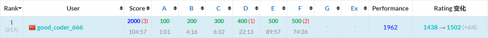

# ac-predictor-extension-CN

ac-predictor 的汉化版，感谢 [@key-moon](https://github.com/key-moon) 提供[原版脚本](https://github.com/key-moon/ac-predictor/tree/master/ac-predictor-extension)（原版为日语）。

本人不会日语，翻译主要依靠日常使用经验，有道/谷歌翻译辅助。**欢迎 PR 改进翻译。**

改过的版本我用了好久，没发现什么问题，如果真有问题欢迎提 [issue](https://github.com/GoodCoder666/ac-predictor-extension-CN/issues)。

> **Note**
>
> 目前项目只是对原版脚本进行了翻译，没有做别的事。后续会移除无用功能（tweet）并优化代码。

## 使用方法

### 1. 安装 Tampermonkey 浏览器插件

> 已经安装过插件的可以跳过此步。

打开官网 [https://www.tampermonkey.net/](https://www.tampermonkey.net/)，按照提示操作即可。

支持的浏览器：Chrome、(新版) Edge、Firefox、Safari、Opera Next。理论上支持所有 Chromium 内核的浏览器。

### 2. 将脚本添加到 Tampermonkey

#### 方法1：使用 Greasy Fork 安装脚本（推荐）

过几天会把脚本发在 Greasy Fork 上，请先使用下面的方法。

#### 方法2：直接添加脚本

1. 复制代码：选择 [ac-predictor.js](./ac-predictor.js) 或 [ac-predictor.min.js](./ac-predictor.min.js)（UglifyJS 压缩的版本）并复制。
2. 添加脚本：打开 Tampermonkey 选项，选择“+”，用刚复制的代码将原来的替换掉，按下 <kbd>Ctrl</kbd>+<kbd>S</kbd> 即可。

#### 方法3：使用外部引用

> 优点：操作简单，可以自动更新脚本
>
> ⚠️请仅在网络好（GitHub 访问稳定）的情况下使用此方法，否则无法正常使用！⚠️

直接复制下面的内容：

```javascript
// ==UserScript==
// @name        ac-predictor-cn
// @namespace   https://github.com/GoodCoder666/ac-predictor-extension-CN
// @icon        https://atcoder.jp/favicon.ico
// @version     1.2.16
// @description AtCoder 预测工具 (由GoodCoder666翻译为简体中文)
// @author      GoodCoder666
// @license     MIT
// @supportURL  https://github.com/GoodCoder666/ac-predictor-extension-CN/issues
// @match       https://atcoder.jp/*
// @exclude     https://atcoder.jp/*/json
// @require     https://github.com/GoodCoder666/ac-predictor-extension-CN/raw/main/ac-predictor.min.js
// ==/UserScript==
```

再使用方法2的第二步添加脚本即可。

### 3. 测试是否添加成功

打开 [AtCoder](https://atcoder.jp/)，页面右侧应出现一个向左的箭头，此时随便打开一场比赛的 standings（如 [ABC285](https://atcoder.jp/contests/abc285/standings)），稍等几秒：



如果你发现表格右侧多出来了两列，那么恭喜，你的 ac-predictor-cn 插件已经生效。

## 版权

本项目使用 [MIT License](./LICENSE)。

> This project is licensed under the [MIT License](./LICENSE).
>
> Thanks to [@key-moon](https://github.com/key-moon) for the [original script](https://github.com/key-moon/ac-predictor/tree/master/ac-predictor-extension) (Japanese).
